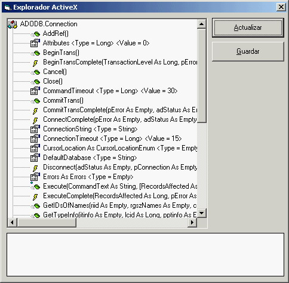



## ActiveX Explorer/Explorador ActiveX

### Description

ActiveXExplorer is a DLL COM+ component that enables to browse a registered ActiveX Component Properties and Values at RunTime, ActiveXExplorer es un componente COM+ que permite mostrar las propiedades en tiempo de ejecucion de un componente activex registrado.
 
### More Info
 

             |
---                |---
**Submitted On**   |2004-08-26 18:30:38
**By**             |[Quiqueze](https://github.com/Planet-Source-Code/PSCIndex/blob/master/ByAuthor/quiqueze.md)
**Level**          |Advanced
**User Rating**    |5.0 (20 globes from 4 users)
**Compatibility**  |VB 6\.0
**Category**       |[OLE/ COM/ DCOM/ Active\-X](https://github.com/Planet-Source-Code/PSCIndex/blob/master/ByCategory/ole-com-dcom-active-x__1-29.md)
**World**          |[Visual Basic](https://github.com/Planet-Source-Code/PSCIndex/blob/master/ByWorld/visual-basic.md)
**Archive File**   |[ActiveX\_Ex1786348262004\.zip](https://github.com/Planet-Source-Code/quiqueze-activex-explorer-explorador-activex__1-55839/archive/master.zip)

